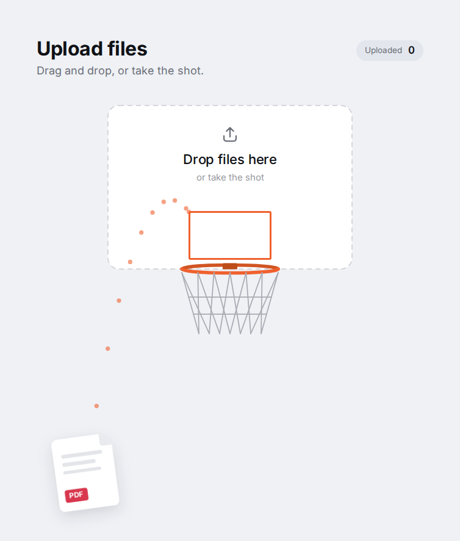

# basketball-upload

Drag and drop, or take the shot.

A file upload where the dropzone is a backboard. Drop your files on it, or pull a file back like a slingshot and score it into the basket: the dots show exactly where it is going. Every file that goes in is uploaded, with its progress in the list below.

**[Live demo](https://sehv-oss.github.io/basketball-upload/)**



## Credits

Design by **Jorge Molina** — [jm-fuster](https://github.com/jm-fuster) on GitHub, [@jm_fuster](https://www.figma.com/@jm_fuster) on Figma Community, [jorgemolinafuster.com](https://jorgemolinafuster.com).

This project is an independent, faithful code implementation of his basketball upload design, published on Figma Community. It is not affiliated with or endorsed by the author. See [NOTICE.md](NOTICE.md) for what was added along the way.

## Packages

| Package                                               | What                                                      |
| ----------------------------------------------------- | --------------------------------------------------------- |
| [`@sehv-oss/basketball-upload`](packages/core)        | The `<basketball-upload>` Web Component, for any stack    |
| [`@sehv-oss/basketball-upload-react`](packages/react) | `<BasketballUpload>`, a thin React 19 component around it |

### Web Component

```bash
npm install @sehv-oss/basketball-upload
```

```html
<basketball-upload multiple accept="image/*,.pdf"></basketball-upload>

<script type="module">
  import {
    registerBasketballUpload,
    createXhrUploader,
  } from '@sehv-oss/basketball-upload';

  registerBasketballUpload();
  document.querySelector('basketball-upload').uploader = createXhrUploader({
    url: '/api/uploads',
  });
</script>
```

### React

```bash
npm install @sehv-oss/basketball-upload-react
```

```tsx
import {
  BasketballUpload,
  createXhrUploader,
} from '@sehv-oss/basketball-upload-react';

const uploader = createXhrUploader({ url: '/api/uploads' });

export function Uploads() {
  return (
    <BasketballUpload multiple accept="image/*,.pdf" uploader={uploader} />
  );
}
```

The [core README](packages/core/README.md) documents the whole API: attributes, events, theming tokens, parts, file types, uploads and forms.

## Development

Requires Node.js 26 (`.nvmrc`) and pnpm through Corepack.

```bash
corepack enable
pnpm install
pnpm site:dev        # the demo site, running the packages from their sources
pnpm build           # type checks, builds both packages, then the site
pnpm test:setup      # once: the Chromium used by the browser tests
pnpm test            # unit tests (Node) and element/React tests (Chromium)
pnpm lint            # cspell and prettier
```

The site serves the element alone, at the size of the reference design, at `/basketball-upload/?reference`: compare it with the screenshots in [`docs/design/reference`](docs/design/reference).

Architecture decisions are recorded in [`docs/adr`](docs/adr).

## License

[ISC](LICENSE)
